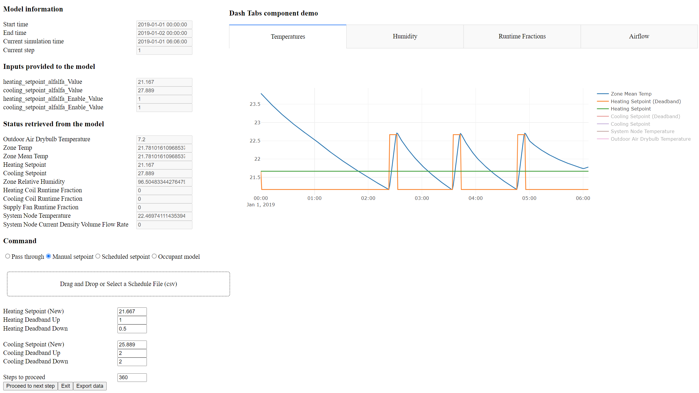

# CoSimAlfalfa
CoSimulation framework using Alfalfa (without BCS)

## Setup procedure
1. Clone this repository. Make sure to clone submodule as well (check the existence of the folder `occupant_model`)
2. Setup alfalfa:
   1. Install docker-desktop (https://www.docker.com/products/docker-desktop/)
   2. Create a folder named `alfalfa` inside the repository folder
   3. Download Alfalfa (version 0.5.1: https://github.com/NREL/alfalfa/archive/refs/tags/v0.5.1.zip) and unzip the contents such that `pyproject.toml` of Alfalfa is under the folder `alfalfa` you created.
      1. NOTE: If you are using windows, you may need to change EOL of all the shell scripts (.sh files) to Linux standard (LF) under the folder `alfalfa/deploy` (for example, `start_worker.sh` file). Otherwise, if EOL is CRLF, alfalfa may not start up properly (you will notice that `alfalfa_worker` is not working as it cannot find some shell script.)
   4. Build `alfalfa` by running `docker-compose build` at the folder `alfalfa` you created (If it cannot find Alfalfa, revisit step 2-ii to check if the contents are in the right location.
      1. Note: If you have previously built the container, running with no cache option `docker-compose build --no-cache` is recommended.
4. Setup dependencies for co-simulation framework:
   1. Create a conda virtual environment using `environment.yml` file `conda env create --file environment.yml --name environment_name_you_want`
   2. Install any missing packages if needed
   3. Note: Currently we use Alfalfa 0.5.1 and Alfalfa_Client 0.5.0

## Run procedure
1. Deploy `Alfalfa` by running `docker-compose up` at the folder `alfalfa` you created
   1. If you notice `alfalfa_worker` is not running as it could not find some files, please check if you changes EOL of the shellp scripts.
   2. If you get a message that there is no network associated with the container, please create a network named `alfalfa_default` by running `docker network create alfalfa_default`
2. Main script is `CoSimMain.py`.
   1. If you notice missing package, please install them using `pip`
   2. The script has following variables:
      1. `debug`: If `True`, print additional information in the console
      2. `test_gui_only`: If `True`, run the framework without simulation. It is to test GUI component.
      3. `test_defalt_model`: If `True`, change the input/output parameters to play with default model provided by Alfalfa. Used when the model name starts with _alfalfa_default_
      4. `model_name`: Among several building models, the user can specify the building model to be used. Please note that the building models are stored at `idf_files/Alfalfa` folder.
         1. Note: Some of the building models might not work properly, as we are still testing them.
      5. `alfalfa_url`: Specifying the location of `Alfalfa`. Currently pointing `localhost` as we did not deploy `Alfalfa` on a cloud location.
      6. `time_start`: The variable storing the start time of the simulation (is global to ensure that some variables can be initialized without running simulation)
      7. `time_end`: The variable storing the end time of the simulation (is global to ensure that some variables can be initialized without running simulation)
      8. `time_step_size`: The variable controlling the step size (not recommend changing this)
      9. The parameters related to occupant model are followed.
      10. Note: Information is grouped into `building_model_information`, `simulation_information`, and `occupant_model_information`.
   3. After you run `CoSimMain.py`, you can open GUI from the location `http://127.0.0.1:8050` (or via the link provided in the console) using a web browser.
3. Currently, the components are modularized in the following scripts:
   1. `CoSimMain.py`: Includes the main script, where a user can change some parameters.
   2. `CoSimCore.py`: Includes core components of co-simulation, which includes 1) communication with Alfalfa, 2) proceeding simulation, and 3) setpoint control.
   3. `CoSimGUI.py`: Includes the functions for 1) GUI components and their update and 2) call-back functions governing the operation of GUI.
   4. `CoSimDict.py`: Includes the dictionary of parameters used across the framework
   5. `CoSimUtils.py`: Includes functions not related to simulation nor GUI.

## Usage and controller development (description based on the screenshot below)

1. The interface includes the following groups of information:
   1. `Model information`: Include the simulation setting
   2. `Inputs provided to the model`: The latest input provided to the building model
   3. `Status retrieved from the model`: The latest output retrieved from the building model
   4. `Command`: Select control mode and proceed simulation step.
      1. Selecting a command mode (radio button):
         1. `Pass through`: Do not provide control input. In this case, the building model typically reuse the previous setpoints/deadbands.
         2. `Manual setpoint`: Provide setpoints/deadbands based on the input section below.
         3. `Scheduled setpoint`: Provide setpoints/deadbands based on the imported schedule file. Only valid when a schedule file is uploaded. This repository contains several example csv files start from `schedule`, specifying setpoint/deadband values for each time step. See the example files for the structure.
         4. `Occupant model`: The submodule `occupant_model` is used to derive setpoints for occupant comfort (No deadband applied)
      2.  Specifying the value in `Steps to proceed` and clicking `Proceed to next step` will proceed the simulation.
   5. A note for controller development: All the controllers are implemented in the function `compute_control()`, where it accepts setpoints, schedule, and simulation record (global variable record) to determine the setpoints to be applied. Please refer to the function for inputs/outputs relations.
   6. A note for building model for alfalfa:
      1. Currently, each building model contains the following components:
         1. Root level: IDF file including the building model, and OSW/OSM file specifying the folder structure and components to be loaded
         2. `weather` or `resource` folder: Includes weather or other resource files to be loaded
         3. `measures` folder: Includes `OpenStudio` measures to be used. The measures bundled with the examples are used to specify input/output points of the building model.
         4. Note: Current version of `Alfalfa` supports EnergyPlus 9.6, so IDF file to be used should be validated with IDF editor bundled with EnergyPlus 9.6 to work with `Alfalfa`
      2. Official instruction (WARNING: may not perfectly agree with current setting!): https://github.com/NREL/alfalfa/wiki/OpenStudio-Model-Setup
   9. Known issue: If you want to start new co-simulation session, you should press `exit` button before you re-run the main script, which will ensure that Alfalfa is ready to import and run a new building model simulation. Otherwise, you need to terminate `Alfalfa` (ctrl-c) and re-deploy.
